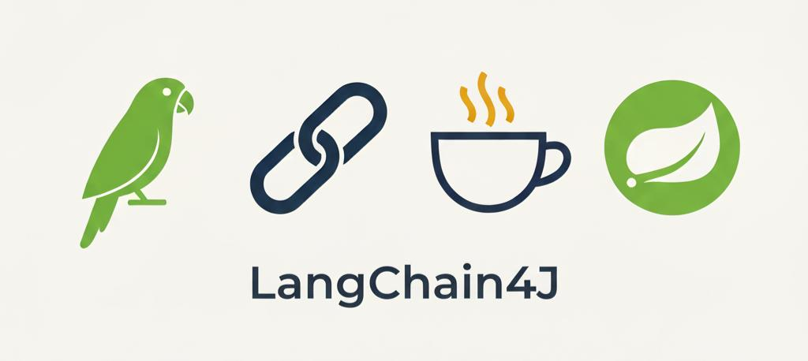
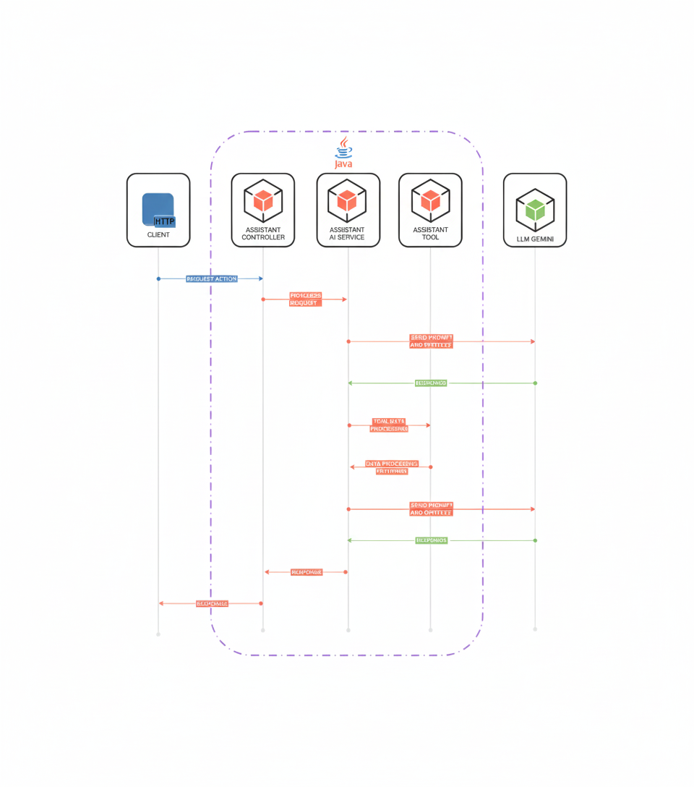

# LangChain4j - Java integration for LLMs



Artificial Intelligence integration into the Java ecosystem was not such a simple thing. While LLM (Large Language Models) development previously looked like something restricted to the Python ecosystem, **LangChain4J** came to be a *game changer*.

In this article I'll show you how to build a simple assistant specialized in Brazilian soccer capable to executing searches about scores, teams and a few other things in real time using the **Gemini** model from Google.

## How it works ?
Unlike from a common chatbot, an Assistant with 'Tools' goes through a cyclic and intelligent flow.

1. **The Client** asks a question (*ex.: 'Who's the championship leader?'*).
2. **Ai Service** sends the question and the context (system instructions) to **Gemini**.
3. **Gemini** doesn't have the data in real time and asks to use a **Tool**.
4. **Java** executes the `AssistantTools` service, gets the data and sends it back to the AI.
5. **The AI** processes the data and gives a 'natural' answer to the user.




---

## 1. Setup and Dependency
For this project I'm using **Spring Boot 4** and the latest version of **LangChain4J**. It's really important has an API Key from [Google AI Studio](https://aistudio.google.com/)

- **pom.xml**
```xml
<!-- currently 1.10.0-beta18 -->
<dependency>
    <groupId>dev.langchain4j</groupId>
    <artifactId>langchain4j-spring-boot-starter</artifactId>
    <version>${langchain.version}</version>
</dependency>

<!-- currently 1.10.0 -->
<dependency>
    <groupId>dev.langchain4j</groupId>
    <artifactId>langchain4j-google-ai-gemini</artifactId>
    <version>${langchain.gemini.version}</version>
</dependency>
```

- **application.properties**
```shell
spring.application.name=langchain4j
langchain4j.google.ai.gemini.api-key=YOUR_GOOGLE_AI_STUDIO_API_KEY
langchain4j.google.ai.gemini.model-name=gemini-2.5-flash
```
- **AssistantConfig.java**
```java
public class AssistantConfig {

    @Value("${langchain4j.google.ai.gemini.api-key}")
    private String geminiApiKey;

    @Value("${langchain4j.google.ai.gemini.model-name}")
    private String geminiModel;

    @Bean
    public GoogleAiGeminiChatModel googleAiGeminiChatModel() {
        return GoogleAiGeminiChatModel.builder()
                .apiKey(geminiApiKey)
                .modelName(geminiModel)
                .build();
    }

    @Bean
    public AssistantAiService assistant(GoogleAiGeminiChatModel model, AssistantTools assistantTools) {
        return AiServices.builder(AssistantAiService.class)
                .chatModel(model)
                .tools(assistantTools)
                .build();
    }
}
```

---

## 2. System Messages and Ai Service
An Assistant without instructions ends up becoming unpredictable. Through the `assistant-instructions.txt` file, we defined that our AI is an expert in Brazilian soccer.

*Obs.: You can access the entire file [here](https://github.com/angelozero/langchain4j/blob/main/src/main/resources/prompts/assistant-instructions.txt)*

- **assistant-instructions.txt**
```text
You are an expert assistant in BRAZILIAN FOOTBALL. Respond ONLY about competitions, clubs, statistics, and history of national football ...
```

- **Prompt Engineering**
The AI's focus here is on about Brazilian Soccer and nothing else. When using `@SystemMessage(fromResource = "...")`, **LangChain4J** injects all those rules into your interactions, ensuring the AI processes the information correctly


- **Ai Service**
The `AssistantAiService` interface, with the `@AiService` annotation, is the entry point for all the AI logic. Spring handles all the implementation at runtime, connecting the **Gemini** model, **Tools** and the **instructions**.

```java
@AiService
public interface AssistantAiService {

    @SystemMessage(fromResource = "prompts/assistant-instructions.txt")
    Result<String> handleRequest(@UserMessage String userMessage);
}
```

## 3. Tools
The **LangChain4J** magic is in the annotation `@Tool`. It provides Java methods to **Gemini** that can be invoked.
When the user asks *'Who's the leader?' **Gemini** doesn't give a random response, it identifies the description from the tool and makes a request to **LangChain4J** to execute the method `getChampionshipLeaders()`.

```java
@Component
public class AssistantTools {

    @Tool("Returns the list of the top 3 teams currently leading the championship.")
    public String getChampionshipLeaders() {
        Map<String, String> currentTable = ChampionshipService.generateRandomTable();

        String leaders = currentTable.entrySet().stream()
                //... some code here
                .collect(Collectors.joining(", "));

        return "The current leaders are: " + leaders;
    }
}
```

## Conclusion
**LangChain4J** integrated with **Gemini** abstracts the LLM's consumption in the Java ecosystem, allowing for the implementation of smart agents. 

- **Natural Language Proccess (NLP)** - High precision in intent and entity extraction.

- **Context Orquestration** - Behaviour control by system instructions

- **Function Calling** - Execution logic services and queries at runtime to retrieve data using **Tools**.

---

# Info

- [Aprenda IA com Java LangChain4j | Arquitetura Spring Boot + Gemini na prática by Michelli Brito](https://www.youtube.com/watch?v=A5i7D7RAPA4)

- [LangChain4J - Offical Documentation](https://docs.langchain4j.dev/intro)

- [Github LangChain4J](https://github.com/langchain4j/langchain4j-spring)

**The project used in this article**
- [Github AngeloZero](https://github.com/angelozero/langchain4j)